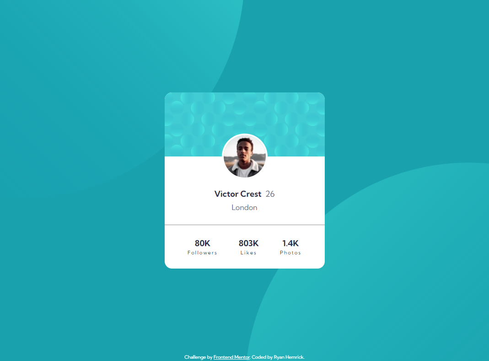

# Frontend Mentor - Profile card component solution

This is a solution to the [Profile card component challenge on Frontend Mentor](https://www.frontendmentor.io/challenges/profile-card-component-cfArpWshJ). Frontend Mentor challenges help you improve your coding skills by building realistic projects. 

## Table of contents

- [Overview](#overview)
  - [The challenge](#the-challenge)
  - [Screenshot](#screenshot)
  - [Links](#links)
- [My process](#my-process)
  - [Built with](#built-with)
- [Author](#author)

## Overview
- A responsive 'profile card' component built with HTML & CSS

### The challenge
- Build out this 'profile card' component to match the provided design spec

### Screenshot

### Links
- Live Site URL: https://exquisite-llama-691dd4.netlify.app

## My process
- Utilized *flexbox* on the **body** element to horizontally and vertically center the profile card
- Utilized *flexbox* to horizontally align the metrics
 

### Built with
- Semantic HTML5 markup
- CSS custom properties
- Flexbox
- Mobile-first approach to CSS

## Author
- Ryan Hemrick